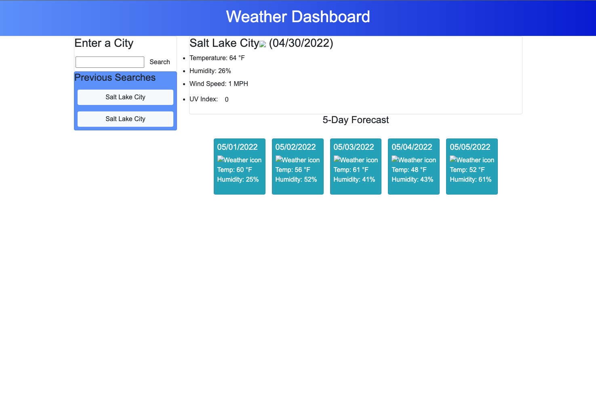

# Weather Dashboard

## Purpose
An application that allows the user to search for weather conditions in a city and retrieve information about the temperature, humidity, wind speed, and UV index. It will also display the weather for the next 5 days coming up, all via the OpenWeather API.
Users will also be able to access their previous searches with the use of local storage.

## Built With
* HTML
* CSS
* JavaScript
* Jquery
* Moment.js
* Bootstrap
* OpenWeather API

## Demo

## Website
 https://lukesturgill.github.io/weather-dashboard/

## Contribution
Luke Sturgill